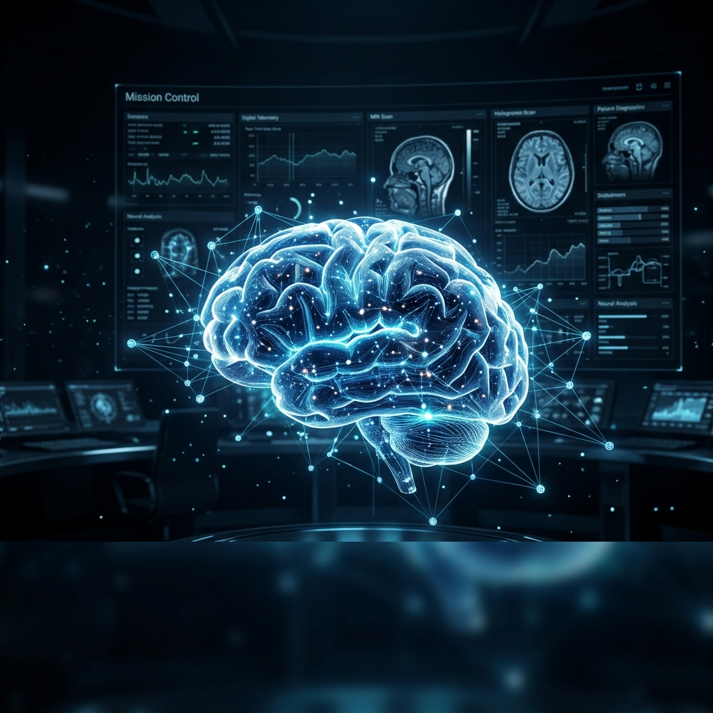
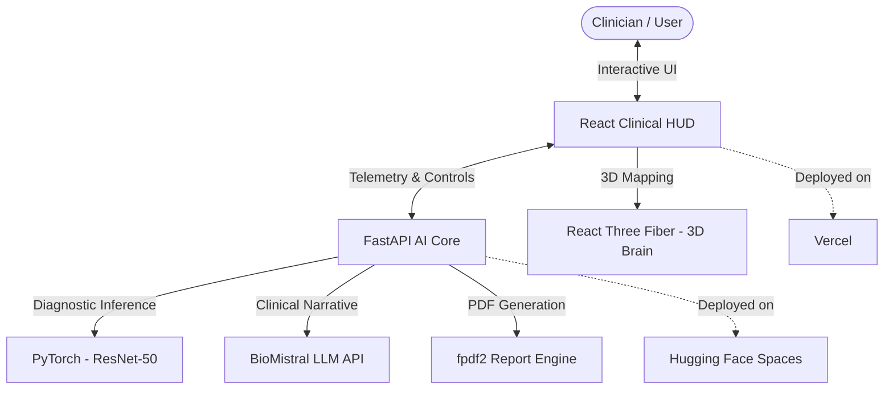
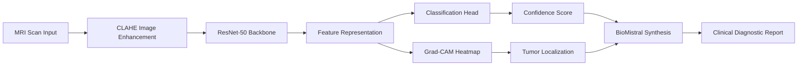

<p align="center">
  
</p>

<h1 align="center">Neural-NEXUS</h1>

<p align="center">
  <strong>Clinical-Grade Brain Tumor Diagnostics via Interpretable Deep Learning</strong>
</p>

<p align="center">
  
  
  
  
  
</p>

<p align="center">
  <a href="https://neural-nexus-git-feature-un-e2e0e7-purvansh-s-projects-3c13a221.vercel.app/"><strong>Explore the Clinical HUD (Frontend) »</strong></a>
  <br />
  <a href="https://huggingface.co/spaces/purvansh01/neural-nexus-backend"><strong>Access the AI Core (Backend) »</strong></a>
</p>

---

## 🔬 Project Mission & Core

**Neural-NEXUS** is engineered to navigate the fundamental challenges of modern medical AI: dataset class disparity, inter-patient variability, and the critical requirement for **clinical interpretability**. It transforms raw MRI imaging into a cinematic diagnostic experience, bridging the gap between "Black-Box" models and actionable neurological insights.

### 🚀 Core System Capabilities

| Pillar | Description | Tech Stack |
| :--- | :--- | :--- |
| **AI-Driven Analysis** | Robust classification across Glioma, Meningioma, Pituitary, and Healthy controls. | ResNet-50 + Inverse-Frequency Weighting |
| **Spatial Interpretability** | Grad-CAM heatmaps providing visual proof for every diagnostic decision. | Gradient-weighted Class Activation Mapping |
| **3D Spatial Copilot** | An interactive 3D brain viewer mapping 2D findings to anatomical coordinates. | React Three Fiber + Three.js |
| **Narrative Synthesis** | Automated conversion of raw diagnostic telemetry into clinical narratives. | BioMistral LLM Integration |
| **Automated Reporting** | One-click localized PDF reports with embedded heatmaps and risk assessments. | fpdf2 Engine |

---

## 🛠️ System Architecture

Neural Nexus follows a decoupled, high-performance architecture optimized for real-time clinical workflows.



---

## 🧪 ML Diagnostic Pipeline

The system processes MRI scans through a multi-stage pipeline designed for both accuracy and transparency.



---

## 📚 Theoretical Foundations

### 1. Residual Learning and Identity Mapping
Neural-NEXUS utilizes a ResNet50 backbone, addressing the **degradation problem** in deep networks.
*   **The Residual Solution**: Instead of learning a direct mapping $H(x)$, we fit a residual mapping $F(x) = H(x) - x$. The original mapping is recast as $F(x) + x$.
*   **Significance**: It is mathematically simpler to optimize residuals. If an identity mapping is optimal, the network easily drives weights to zero via skip-connections.

### 2. Weighted Cross-Entropy Loss
To handle class imbalance (e.g., rare tumor types vs. common ones), we employ **Inverse-Frequency Weighting**.
The penalty for class $j$ is scaled by:
$$w_j = \frac{N}{C \cdot n_j}$$
Where $N$ is total samples, $C$ is number of classes, and $n_j$ is the count for class $j$.

### 3. Grad-CAM: Visual Proof
Interpretability is achieved via Grad-CAM, producing a localization map $L^c_{Grad-CAM}$.
1.  **Weight Computation**: $\alpha^c_k = \frac{1}{Z} \sum_i \sum_j \frac{\partial y^c}{\partial A^k_{ij}}$
2.  **Activation Mapping**: $L^c_{Grad-CAM} = ReLU(\sum_k \alpha^c_k A^k)$
This identifies the specific structural features (density shifts, contrast anomalies) that drove the classification.

---

## 📊 Dataset & Performance

**Kaggle Source**: [Brain Tumor Healthcare Dataset](https://www.kaggle.com/datasets/purvanshjoshi1/healthcare)

| Pathology Category | Image Count | Theory of Role |
| :--- | :--- | :--- |
| **Glioma** | 5,625 | High-volume positive class |
| **Meningioma** | 3,978 | Structural positive class |
| **Pituitary** | 4,363 | Endocrine-origin positive class |
| **No Tumor** | 3,847 | Baseline / Negative Control |

**Result**: Tested at **91.88% accuracy** with verified clinical stability.

---

## 🖼️ Clinical Gallery

### Tier 1: Performance & Statistical Validation
The system demonstrated a **91.88% confusion matrix accuracy**, confirming its theoretical stability across all four pathological categories.


---

### Tier 2: Interpretability & Localization Evidence
Neural-NEXUS provides visual proof for every diagnostic decision. Grade-weighted Class Activation Mapping (Grad-CAM) identifies the specific density variations and contrast anomalies that drive the classification.

<table border="0">
  <tr>
    <td width="50%"><br><em><strong>Pathological Localization</strong>: Heatmaps correspond to detected tumor masses.</em></td>
    <td width="50%"><br><em><strong>Healthy Control</strong>: The model evaluates structural symmetry in negative cases.</em></td>
  </tr>
</table>

---

### Tier 3: Unified Clinical HUD & Intelligence
The frontend provides a high-density "Mission Control" aesthetic, integrating raw MRI telemetry with 3D spatial mapping and BioMistral clinical narratives.

| Interactive Split-View (RAW vs Heatmap) | High-Density Diagnostic Dashboard |
| :--- | :--- |
|  |  |

#### 📊 Diagnostic Summary & Telemetry
The final synthesis combines classification confidence, spatial coordinates, and clinical risk assessments into a unified clinician-ready view.


---

## ⚙️ Setup & Installation

### Backend (Python/FastAPI)
```bash
cd backend
python -m venv venv
source venv/bin/activate  # or venv\Scripts\activate
pip install -r requirements.txt
python main.py
```

### Frontend (React/Vite)
```bash
cd frontend
npm install
npm run dev
```

### Docker Deployment
```bash
docker-compose up --build
```

---

## ⚖️ License & Credits
Licensed under the MIT License. Developed by **Purvansh Joshi**.
The project incorporates BioMistral for clinical LLM capabilities and Three.js for spatial visualization.
