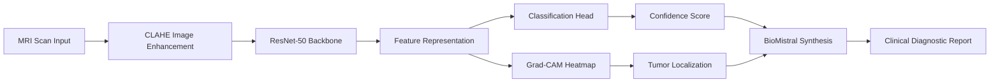

# Neural-NEXUS: Clinical-Grade Brain Tumor Diagnostics via Interpretable Deep Learning 

**Neural-NEXUS** is a state-of-the-art AI diagnostic platform designed to assist clinicians in the detection, classification, and reporting of brain tumors from MRI scans. It bridges the gap between raw medical imaging and actionable clinical insights using high-performance deep learning and a cinematic "Mission Control" interface.

[Live Demo (Frontend)](https://neural-nexus-git-feature-un-e2e0e7-purvansh-s-projects-3c13a221.vercel.app/) | [AI Core (Backend)](https://huggingface.co/spaces/purvansh01/neural-nexus-backend)

---

## 🚀 Key Pillars

- **🧠 AI-Driven Analysis**: Robust classification across 4 classes (Glioma, Meningioma, Pituitary, Healthy) using an optimized ResNet-50 architecture.
- **🔍 Spatial Interpretability**: Gradient-weighted Class Activation Mapping (Grad-CAM) providing visual evidence for every diagnostic decision.
- **🕹️ 3D Spatial Copilot**: An interactive 3D brain viewer (React Three Fiber) that maps 2D findings into an anatomical coordinate system.
- **📝 Clinical Narrative Engine**: Integration with **BioMistral LLM** to transform raw telemetry into human-readable clinical narratives.
- **📄 Automated Reporting**: One-click generation of clinician-ready PDF reports with embedded diagnostic heatmaps and risk assessments.

---

## 🛠️ System Architecture

Neural Nexus follows a decoupled, high-performance architecture optimized for real-time clinical workflows.


---

## 🧪 ML Diagnostic Pipeline

The system processes MRI scans through a multi-stage pipeline designed for both accuracy and transparency.



---

## 📚 Theoretical Foundations

### 1. Residual Learning and Identity Mapping
Neural-NEXUS utilizes a ResNet50 backbone, addressing the **degradation problem** in deep networks.
*   **The Residual Solution**: Instead of learning a direct mapping $H(x)$, we fit a residual mapping $F(x) = H(x) - x$. The original mapping is recast as $F(x) + x$.
*   **Significance**: It is mathematically simpler to optimize residuals. If an identity mapping is optimal, the network easily drives weights to zero via skip-connections.

### 2. Weighted Cross-Entropy Loss
To handle class imbalance (e.g., rare tumor types vs. common ones), we employ **Inverse-Frequency Weighting**.
The penalty for class $j$ is scaled by:
$$w_j = \frac{N}{C \cdot n_j}$$
Where $N$ is total samples, $C$ is number of classes, and $n_j$ is the count for class $j$.

### 3. Grad-CAM: Visual Proof
Interpretability is achieved via Grad-CAM, producing a localization map $L^c_{Grad-CAM}$.
1.  **Weight Computation**: $\alpha^c_k = \frac{1}{Z} \sum_i \sum_j \frac{\partial y^c}{\partial A^k_{ij}}$
2.  **Activation Mapping**: $L^c_{Grad-CAM} = ReLU(\sum_k \alpha^c_k A^k)$
This identifies the specific structural features (density shifts, contrast anomalies) that drove the classification.

---

## 📊 Dataset & Performance

**Kaggle Source**: [Brain Tumor Healthcare Dataset](https://www.kaggle.com/datasets/purvanshjoshi1/healthcare)

| Pathology Category | Image Count | Theory of Role |
| :--- | :--- | :--- |
| **Glioma** | 5,625 | High-volume positive class |
| **Meningioma** | 3,978 | Structural positive class |
| **Pituitary** | 4,363 | Endocrine-origin positive class |
| **No Tumor** | 3,847 | Baseline / Negative Control |

**Result**: Tested at **91.88% accuracy** with verified clinical stability.

---

## 🖼️ Clinical Gallery

<table border="0">
  <tr>
    <td><br><em>Confusion Matrix</em></td>
    <td><br><em>Tumor Localization</em></td>
  </tr>
  <tr>
    <td colspan="2"><br><em>Full Clinical HUD & Report</em></td>
  </tr>
</table>

---

## ⚙️ Setup & Installation

### Backend (Python/FastAPI)
```bash
cd backend
python -m venv venv
source venv/bin/activate  # or venv\Scripts\activate
pip install -r requirements.txt
python main.py
```

### Frontend (React/Vite)
```bash
cd frontend
npm install
npm run dev
```

### Docker Deployment
```bash
docker-compose up --build
```

---

## ⚖️ License & Credits
Licensed under the MIT License. Developed by **Purvansh Joshi**.
The project incorporates BioMistral for clinical LLM capabilities and Three.js for spatial visualization.
